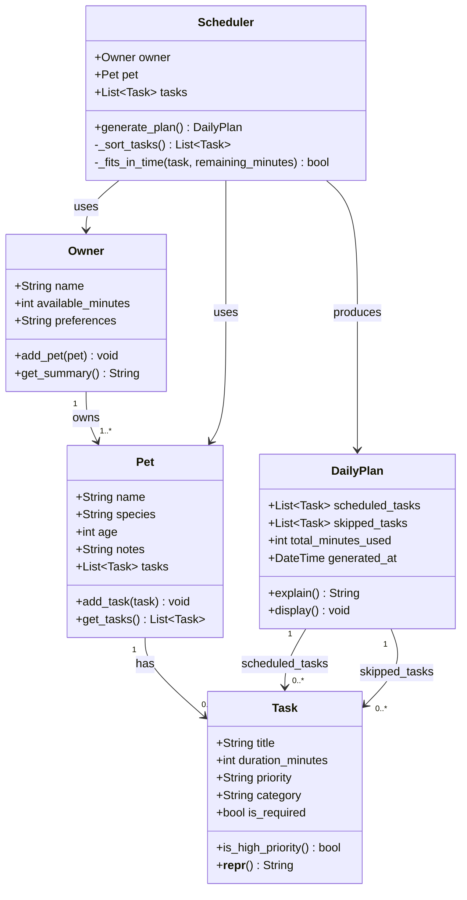

```mermaid
classDiagram
    class Owner {
        +String name
        +int available_minutes
        +String preferences
        +add_pet(pet) void
        +get_summary() String
    }

    class Pet {
        +String name
        +String species
        +int age
        +String notes
        +List~Task~ tasks
        +add_task(task) void
        +get_tasks() List~Task~
    }

    class Task {
        +String title
        +int duration_minutes
        +String priority
        +String category
        +bool is_required
        +is_high_priority() bool
        +__repr__() String
    }

    class Scheduler {
        +Owner owner
        +Pet pet
        +List~Task~ tasks
        +generate_plan() DailyPlan
        -_sort_tasks() List~Task~
        -_fits_in_time(task, remaining_minutes) bool
    }

    class DailyPlan {
        +List~Task~ scheduled_tasks
        +List~Task~ skipped_tasks
        +int total_minutes_used
        +DateTime generated_at
        +explain() String
        +display() void
    }

    Owner "1" --> "1..*" Pet : owns
    Pet "1" --> "0..*" Task : has
    Scheduler --> Owner : uses
    Scheduler --> Pet : uses
    Scheduler --> DailyPlan : produces
    DailyPlan "1" --> "0..*" Task : scheduled_tasks
    DailyPlan "1" --> "0..*" Task : skipped_tasks
```
